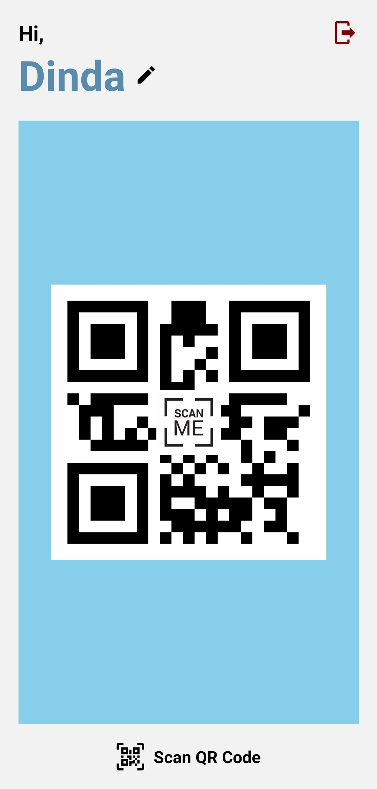

<h1 align="center">SCAN ME!</h1>

## Built with

## Requirements
1. <a href="https://nodejs.org/en/download/">Node JS</a>
2. Node_modules
3. Physical device or Android emulator
4. Code editor (Visual Studio Code)
5. Web Browser (Google Chrome)

## How to run the app?
1. Open app's directory in CMD/Terminal
2. Type `yarn install`
3. Open your Android emulator or connect your real device
4. Type `yarn start` in CMD/Terminal
5. In another CMD/Terminal, type `yarn android`

## How this app work?
1. Open your installed scanme app
2. Enter your name
3. scanme app will automatically generate your qr code
4. Press, `Scan QR Code` to scan your friend qr code
5. Then, your friend name will be showed
